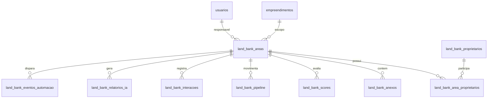
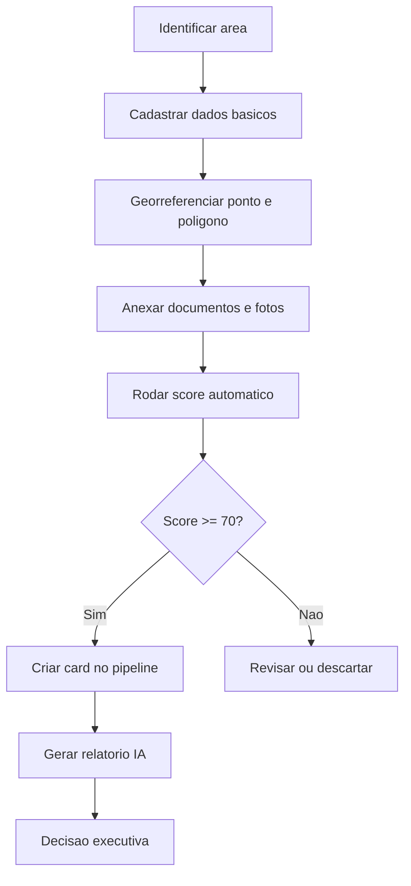
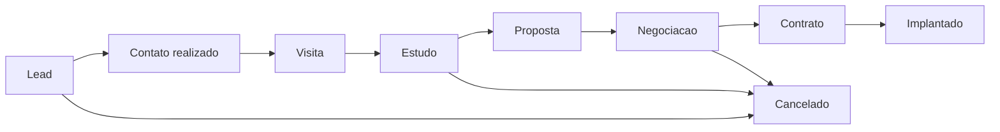
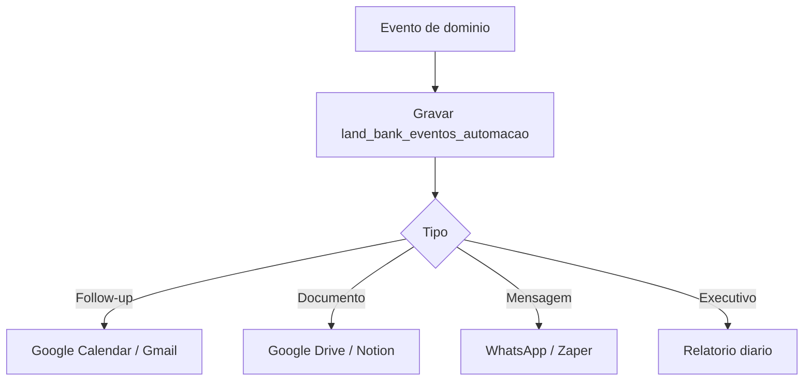

# NEXA LAND BANK - Blueprint Enterprise

## 1. Visao Executiva

O NEXA LAND BANK sera a plataforma nacional de inteligencia imobiliaria da Nexa Malls para cadastrar, mapear, analisar, priorizar e converter terrenos, imoveis e oportunidades de desenvolvimento comercial.

O produto deve nascer como modulo do Nexa OS, mas com fronteiras tecnicas preparadas para virar SaaS B2B no futuro. A regra central e simples: o PostgreSQL/PostGIS e a fonte oficial dos dados, o Notion continua como camada operacional e colaborativa, e toda entidade relevante deve ser multiempreendimento, auditavel e mensuravel.

### Objetivos de negocio

- Centralizar terrenos, imoveis, proprietarios, documentos, estudos e historico comercial.
- Criar mapa nacional de oportunidades com filtros por cidade, status, metragem, vocacao e valor.
- Pontuar automaticamente areas por criterios de fluxo, renda, densidade, acesso, visibilidade, concorrencia e risco urbanistico.
- Operar pipeline de prospeccao e negociacao em formato CRM.
- Gerar relatorios executivos com IA para tomada de decisao.
- Permitir captura de campo por mobile com fotos, geolocalizacao e documentos.

### Principios de arquitetura

- **PostgreSQL + PostGIS como core transacional e geoespacial.**
- **Supabase Storage para documentos, fotos, videos e estudos.**
- **Next.js como aplicacao operacional e BFF inicial.**
- **NestJS como API de dominio quando o produto separar o core SaaS do front.**
- **RLS e multiempreendimento desde o MVP.**
- **Eventos e audit trail para integracoes, automacoes e IA.**
- **Map provider abstraido para usar Mapbox no mapa operacional e Google Maps/Street View/Places onde houver ganho de dado.**

---

## 2. Arquitetura Completa

### Arquitetura recomendada para o estado atual

```txt
Usuarios Nexa
  |
  v
Next.js App Router - Vercel
  |-- UI operacional
  |-- Server Actions / Route Handlers
  |-- Auth middleware
  |-- BFF para Supabase, Maps, IA e automacoes
  |
  v
Supabase
  |-- PostgreSQL + PostGIS
  |-- Row Level Security
  |-- Storage
  |-- Realtime opcional
  |
  v
Integracoes
  |-- Google Maps / Street View / Places
  |-- Mapbox
  |-- Notion
  |-- Google Drive
  |-- Gmail / Calendar
  |-- WhatsApp / Zaper
  |-- OpenAI
```

### Arquitetura enterprise alvo

```txt
Web App Next.js
Mobile PWA
Field Capture
      |
      v
API Gateway / BFF
      |
      +-------------------+
      |                   |
      v                   v
NestJS Domain API      Worker Queue
      |                   |
      |                   +-- scoring jobs
      |                   +-- AI reports
      |                   +-- map enrichment
      |                   +-- notifications
      v
PostgreSQL + PostGIS
      |
      +-- Supabase Storage
      +-- Analytics marts
      +-- Audit/event log
```

### Decisao tecnica

Para o MVP interno, manter o padrao atual do repo: Next.js + Supabase. Isso reduz tempo de entrega e aproveita migrations, RLS, componentes e integracoes ja existentes no Nexa OS.

Para a comercializacao SaaS, extrair as regras de dominio para um servico NestJS:

- `LandAreasModule`
- `OwnersModule`
- `ScoringModule`
- `PipelineModule`
- `InteractionsModule`
- `DocumentsModule`
- `ReportsAIModule`
- `IntegrationsModule`
- `PermissionsModule`

---

## 3. Modelagem do Banco de Dados

### Entidades centrais



### Estrategia geoespacial

- `latitude` e `longitude` ficam salvas para formulario, exportacao e integracoes.
- `ponto geography(Point, 4326)` e usado para consultas por raio, distancia e clustering.
- `poligono geometry(MultiPolygon, 4326)` guarda a delimitacao da area.
- Indices `GIST` devem ser criados sobre `ponto` e `poligono`.
- Calculos de distancia devem usar `ST_DWithin`, `ST_Distance` e `ST_Intersects`.

### Tabelas

1. `land_bank_areas`: cadastro mestre da area.
2. `land_bank_proprietarios`: proprietarios, vendedores e representantes.
3. `land_bank_area_proprietarios`: vinculo N:N entre area e proprietario.
4. `land_bank_anexos`: matricula, IPTU, fotos, videos e estudos.
5. `land_bank_scores`: score automatico e criterios normalizados.
6. `land_bank_pipeline`: pipeline comercial de prospeccao e conversao.
7. `land_bank_interacoes`: ligacoes, WhatsApp, reunioes, visitas e emails.
8. `land_bank_relatorios_ia`: respostas e relatorios executivos gerados por IA.
9. `land_bank_eventos_automacao`: eventos para Notion, Gmail, Calendar, Drive, WhatsApp e alertas.
10. `land_bank_permissoes_usuario`: excecoes individuais de acesso.

### Campos principais de `land_bank_areas`

```sql
codigo, nome, cidade, estado, bairro, cep, endereco_completo,
latitude, longitude, google_maps_url, ponto, poligono,
area_total_m2, frente_m, topografia, zoneamento,
coeficiente_aproveitamento, taxa_ocupacao, altura_maxima_m,
status, valor_pedido, valor_m2, valor_potencial,
viavel_bts, viavel_strip_mall, viavel_sale_leaseback
```

---

## 4. Estrutura SQL Inicial

A migration inicial esta em:

`supabase/migrations/011_nexa_land_bank.sql`

Ela cria:

- extensao `postgis`;
- tabelas principais do modulo;
- checks de status e etapas;
- indices operacionais e geoespaciais;
- triggers de `updated_at`;
- RLS por `empreendimento_id`, usando a funcao atual `app_empreendimentos_do_usuario()`.

---

## 5. Mapa Interativo

### Stack recomendada

- **Mapbox GL JS** para mapa operacional, clusters, heatmap e desenho de poligonos.
- **Google Maps Platform** para links externos, Street View, Places, geocoding e validacao de endereco.
- **PostGIS** para filtros, consultas por raio, interseccoes, distancia e agregacoes.

### Funcionalidades

- Visualizacao de pontos e poligonos.
- Clusters por zoom.
- Heatmap por score, valor potencial ou densidade de oportunidades.
- Alternancia entre mapa vetorial, satelite e hibrido.
- Street View por coordenada.
- Filtros por cidade, estado, preco, metragem, status e vocacao.
- Ferramenta de desenho para delimitar poligono.
- Busca por endereco e geocodificacao.
- Clique na area abre painel lateral com resumo, score e proximas acoes.

### Consultas PostGIS essenciais

```sql
-- Areas em um raio de 2 km
select *
from land_bank_areas
where st_dwithin(
  ponto,
  st_setsrid(st_makepoint(:longitude, :latitude), 4326)::geography,
  2000
)
and deleted_at is null;

-- Areas dentro de uma bounding box do mapa
select *
from land_bank_areas
where poligono && st_makeenvelope(:west, :south, :east, :north, 4326)
and deleted_at is null;
```

---

## 6. Score Automatico

### Modelo de pontuacao

O score deve ir de 0 a 100 e salvar tanto a nota total quanto os criterios individuais. A formula inicial recomendada:

| Criterio | Peso |
| --- | ---: |
| Fluxo de veiculos/pedestres | 20 |
| Renda do entorno | 15 |
| Densidade populacional | 15 |
| Concorrencia | 10 |
| Facilidade de acesso | 15 |
| Visibilidade | 15 |
| Viabilidade urbanistica | 10 |

### Formula

```txt
score_total =
  fluxo_score * 0.20 +
  renda_score * 0.15 +
  densidade_score * 0.15 +
  concorrencia_score * 0.10 +
  acesso_score * 0.15 +
  visibilidade_score * 0.15 +
  urbanistico_score * 0.10
```

### Classificacao

| Score | Classificacao |
| ---: | --- |
| 85-100 | Excelente |
| 70-84 | Boa |
| 55-69 | Media |
| 40-54 | Baixa |
| 0-39 | Descartar ou revisar premissas |

### Regras importantes

- Concorrencia deve ser invertida: pouca concorrencia qualificada pode ser positiva, concorrencia excessiva reduz score.
- Score nao substitui estudo de viabilidade; ele prioriza o pipeline.
- Toda nota automatica deve guardar `fontes`, `premissas` e `confidence_score`.
- A IA pode sugerir ajustes, mas o score oficial deve ser calculavel e auditavel.

---

## 7. Pipeline Comercial

### Etapas

```txt
Lead
Contato realizado
Visita
Estudo
Proposta
Negociacao
Contrato
Implantado
Cancelado
```

### Regras de operacao

- Drag and drop estilo kanban.
- Cada card representa uma oportunidade vinculada a uma area.
- Mudanca de etapa gera evento em `land_bank_eventos_automacao`.
- Campos minimos por card: responsavel, proxima acao, data da proxima acao, probabilidade, valor potencial e motivo de perda.
- O pipeline deve permitir filtros por cidade, tipo de negocio, responsavel e prioridade.

---

## 8. CRM de Proprietarios

### Historico unificado

Registrar em `land_bank_interacoes`:

- ligacoes;
- WhatsApp;
- reunioes;
- visitas;
- emails;
- notas internas;
- tarefas de follow-up;
- anexos vinculados a interacao.

### Regras

- Toda interacao deve ter responsavel.
- Interacoes podem se vincular a area, proprietario e/ou pipeline.
- Emails e WhatsApp podem ser importados por integracao, mas precisam ser normalizados para o mesmo historico.
- Dados sensiveis de CPF/CNPJ devem respeitar RLS e mascaramento no front para perfis externos.

---

## 9. Dashboard Executivo

### KPIs principais

- Quantidade de areas cadastradas.
- m2 mapeados.
- Valor potencial total.
- Areas por cidade.
- Areas por status.
- Areas por vocacao: BTS, strip mall, sale leaseback.
- Score medio por cidade.
- Pipeline por etapa.
- Taxa de conversao por etapa.
- Tempo medio ate proposta.
- Areas descartadas por motivo.

### Tabelas derivadas futuras

Para escala nacional, criar views/materialized views:

- `vw_land_bank_funil`
- `vw_land_bank_kpis_cidade`
- `vw_land_bank_kpis_responsavel`
- `vw_land_bank_score_distribution`
- `vw_land_bank_alertas`

---

## 10. IA

### Casos de uso

- Analise preliminar de terreno.
- Viabilidade para strip mall.
- Viabilidade para BTS.
- Melhor uso imobiliario.
- Principais riscos.
- Potencial de locacao.
- Relatorio executivo automatico.
- Checklist de dados faltantes.

### Entrada minima para IA

- Dados cadastrais e geograficos.
- Caracteristicas urbanisticas.
- Score e criterios.
- Historico comercial.
- Anexos relevantes.
- Dados de entorno, quando disponiveis.
- Premissas declaradas pelo usuario.

### Saida padrao

1. Resumo executivo.
2. Leitura do terreno.
3. Leitura do entorno.
4. Acesso, visibilidade e fluxo.
5. Vocacao comercial.
6. Produtos possiveis.
7. Produto recomendado.
8. Segmentos comerciais aderentes.
9. Pontos de atencao.
10. Riscos.
11. Potencial para investidores.
12. Proximos passos.

### Guardrails

- Separar fato, premissa e inferencia.
- Nao afirmar viabilidade sem dados minimos.
- Registrar versao do prompt, modelo, usuario e timestamp.
- Salvar o relatorio em `land_bank_relatorios_ia`.
- Exigir aprovacao humana antes de enviar relatorio externo.

---

## 11. Mobile

### MVP mobile responsivo

- PWA em Next.js.
- Cadastro rapido em campo.
- Geolocalizacao automatica pelo browser.
- Captura/upload de fotos.
- Upload de documentos.
- Campo de observacoes por voz no futuro.
- Criacao de follow-up imediato.
- Modo offline futuro com fila local.

### Fluxo de campo

```txt
Abrir mobile
  -> Capturar localizacao
  -> Preencher dados basicos
  -> Fotografar fachada/terreno
  -> Desenhar ou ajustar poligono
  -> Salvar lead
  -> Criar tarefa de qualificacao
```

Assinatura digital deve ser tratada como integracao posterior com Clicksign, DocuSign ou ZapSign, salvando o envelope/documento assinado em Storage e o status em tabela de documentos.

---

## 12. Permissoes

### Perfis

| Perfil | Acesso |
| --- | --- |
| Administrador | Tudo, incluindo configuracoes, usuarios e integracoes |
| Diretor | Dashboard, relatorios, aprovacoes e todas as areas |
| Comercial | Pipeline, interacoes, propostas e proprietarios permitidos |
| Expansao | Cadastro, mapa, score, estudos e prospeccao |
| Operacoes | Dados tecnicos, visitas, riscos e implantacao |
| Consultor externo | Acesso limitado por area/projeto, sem dados sensiveis |

### Modelo recomendado

- RLS por `empreendimento_id`.
- Perfil global em `usuarios.perfil`.
- Excecoes por usuario em `land_bank_permissoes_usuario`.
- Auditoria para leitura/exportacao de dados sensiveis em fase SaaS.

---

## 13. Automacoes e Integracoes

### Eventos internos

- Area criada.
- Score atualizado.
- Pipeline mudou de etapa.
- Proxima acao vencida.
- Proposta enviada.
- Contrato assinado.
- Area descartada.
- Relatorio IA gerado.

### Integracoes

| Integracao | Uso |
| --- | --- |
| Google Maps | Geocoding, Street View, Places, links externos |
| Mapbox | Mapa operacional, clusters, heatmap e desenho |
| Google Drive | Espelhamento de pastas e documentos executivos |
| Notion | Workspace colaborativo e visoes operacionais |
| Zaper/WhatsApp | Registro de mensagens e notificacoes |
| Gmail | Importacao/envio de emails do historico |
| Google Calendar | Visitas, reunioes e follow-ups |
| OpenAI | Analise de terrenos e relatorios executivos |

---

## 14. Wireframes

### Dashboard Executivo

```txt
+------------------------------------------------------------------+
| NEXA LAND BANK                          [Cidade] [Status] [Tipo] |
+------------------------------------------------------------------+
| Areas cadastradas | m2 mapeados | Valor potencial | Score medio  |
+------------------------------------------------------------------+
| Mapa de calor por cidade             | Pipeline por etapa         |
|                                      | Lead       ####           |
|                                      | Estudo     ##             |
|                                      | Proposta   #              |
+------------------------------------------------------------------+
| Ranking de areas prioritarias                                      |
| Codigo | Area | Cidade | Score | Vocacao | Valor | Proxima acao   |
+------------------------------------------------------------------+
```

### Mapa Interativo

```txt
+----------------------+-------------------------------------------+
| Filtros              | Mapa                                      |
| Cidade               |   clusters / heatmap / poligonos          |
| Estado               |                                           |
| Preco                |                    [painel lateral]       |
| Metragem             |                    Area selecionada       |
| Status               |                    Score                  |
| BTS / Strip / SLB    |                    Proxima acao           |
+----------------------+-------------------------------------------+
```

### Cadastro de Area

```txt
+------------------------------------------------------------------+
| Nova Area                                                        |
+------------------------------------------------------------------+
| Identificacao | Georreferenciamento | Caracteristicas | Anexos    |
+------------------------------------------------------------------+
| Codigo        [________]                                         |
| Nome          [________]                                         |
| Endereco      [_______________________________________________]  |
| Latitude      [____]   Longitude [____]   [usar localizacao]     |
| Poligono      [desenhar no mapa]                                 |
| Salvar rascunho                         [Salvar area]            |
+------------------------------------------------------------------+
```

### Pipeline

```txt
+-------------+-------------+-------------+-------------+----------+
| Lead        | Contato     | Visita      | Estudo      | Proposta |
+-------------+-------------+-------------+-------------+----------+
| Area A      | Area C      | Area E      | Area F      | Area H   |
| score 82    | score 64    | score 77    | score 91    | score 73 |
| prox acao   | prox acao   | prox acao   | prox acao   | prox acao|
+-------------+-------------+-------------+-------------+----------+
```

### Mobile Campo

```txt
+-----------------------------+
| Nova area em campo          |
+-----------------------------+
| [usar minha localizacao]    |
| Nome da area                |
| Endereco detectado          |
| Fotos [+]                   |
| Proprietario                |
| Status inicial              |
| Observacoes                 |
| [Salvar lead]               |
+-----------------------------+
```

---

## 15. Fluxograma dos Processos

### Cadastro e qualificacao



### Pipeline comercial



### Automacoes



---

## 16. APIs Necessarias

### API interna

| Metodo | Endpoint | Uso |
| --- | --- | --- |
| GET | `/api/land-bank/areas` | listar areas com filtros |
| POST | `/api/land-bank/areas` | criar area |
| GET | `/api/land-bank/areas/:id` | detalhe completo |
| PATCH | `/api/land-bank/areas/:id` | atualizar area |
| DELETE | `/api/land-bank/areas/:id` | soft delete |
| POST | `/api/land-bank/areas/:id/anexos` | upload de anexos |
| POST | `/api/land-bank/areas/:id/score` | recalcular score |
| POST | `/api/land-bank/areas/:id/ai-report` | gerar relatorio IA |
| GET | `/api/land-bank/map` | dados otimizados para mapa |
| GET | `/api/land-bank/dashboard` | KPIs executivos |
| GET | `/api/land-bank/pipeline` | kanban |
| PATCH | `/api/land-bank/pipeline/:id/move` | mover etapa |
| POST | `/api/land-bank/interactions` | registrar interacao |
| POST | `/api/land-bank/integrations/notion/sync` | sincronizar Notion |

### APIs externas

- Google Maps Geocoding API.
- Google Maps Street View API.
- Google Places API.
- Mapbox GL JS.
- Mapbox Geocoding opcional.
- Supabase Storage.
- OpenAI Responses API.
- Google Drive API.
- Gmail API.
- Google Calendar API.
- Notion API.
- WhatsApp/Zaper API.

---

## 17. Plano de Desenvolvimento

### Fase 0 - Fundacao

- Validar modelo de dados.
- Aplicar migration PostGIS.
- Definir permissoes.
- Criar seeds iniciais.
- Definir design operacional do modulo.

### Fase 1 - MVP operacional

- Cadastro de areas.
- Upload de anexos.
- Listagem e detalhe.
- Mapa com pontos, filtros e clusters.
- Pipeline kanban.
- Historico de interacoes.
- Dashboard basico.

### Fase 2 - Inteligencia

- Score automatico.
- Heatmap.
- Relatorio IA.
- Dados de entorno.
- Alertas de follow-up.
- Sincronizacao Notion/Drive.

### Fase 3 - Campo e automacao

- PWA mobile.
- Geolocalizacao automatica.
- Captura de fotos.
- Agenda de visitas.
- WhatsApp/Gmail/Calendar.
- Rotina executiva automatica.

### Fase 4 - SaaS readiness

- Separar NestJS Domain API.
- Multi-tenant por organizacao.
- Billing e planos.
- Feature flags.
- Observabilidade.
- Exportacao e importacao.
- API publica.

---

## 18. Cronograma em Sprints

Assumindo sprints de 2 semanas.

| Sprint | Entrega | Resultado |
| --- | --- | --- |
| 1 | Schema, RLS, tipos, seeds e design base | Banco pronto para MVP |
| 2 | Cadastro/listagem/detalhe de areas | CRUD operacional |
| 3 | Upload de anexos e proprietarios | Dossie da area |
| 4 | Mapa com filtros, clusters e painel lateral | Mapa utilizavel |
| 5 | Pipeline drag and drop e interacoes | CRM imobiliario |
| 6 | Score automatico e dashboard executivo | Priorizacao |
| 7 | Relatorio IA e checklist de riscos | Inteligencia aplicada |
| 8 | Mobile PWA e geolocalizacao | Cadastro em campo |
| 9 | Notion, Drive, Gmail, Calendar e WhatsApp | Automacoes |
| 10 | Hardening, auditoria, performance e rollout | Operacao interna |

MVP interno realista: 8 a 12 semanas.
Versao enterprise interna: 16 a 20 semanas.
SaaS comercializavel: 24 a 32 semanas.

---

## 19. Estrutura SaaS Futura

### Multi-tenancy

Adicionar camada acima de `empreendimentos`:

- `organizations`
- `workspaces`
- `workspace_members`
- `plans`
- `subscriptions`
- `usage_events`

No SaaS, `organization_id` vira a chave de isolamento principal. `empreendimento_id` continua como dimensao operacional dentro da organizacao.

### Planos sugeridos

| Plano | Perfil |
| --- | --- |
| Internal | Nexa Malls |
| Pro | imobiliarias, consultores e expansao regional |
| Business | redes varejistas e incorporadoras |
| Enterprise | operadores nacionais com SSO, SLA e API dedicada |

### Controles SaaS

- Billing por usuario, area cadastrada, storage e chamadas de IA.
- Limites por plano.
- Auditoria de exportacoes.
- Dominios customizados em Enterprise.
- Feature flags por modulo.
- Data retention por plano.
- API keys por organizacao.

---

## 20. Custos Estimados de Infraestrutura

Valores abaixo sao referenciais em USD/mes e devem ser revisados antes da contratacao. Fontes consultadas em junho de 2026:

- [Vercel Pricing](https://vercel.com/pricing)
- [Supabase Billing](https://supabase.com/docs/guides/platform/billing-on-supabase)
- [Supabase Compute and Disk](https://supabase.com/docs/guides/platform/compute-and-disk)
- [Mapbox Pricing](https://www.mapbox.com/pricing)
- [Google Maps Platform Pricing](https://mapsplatform.google.com/pricing/)
- [Clerk Pricing](https://clerk.com/pricing)
- [OpenAI API Pricing](https://openai.com/api/pricing/)

### MVP interno

| Item | Estimativa |
| --- | ---: |
| Vercel Pro | US$ 20 por usuario dev + uso |
| Supabase Pro + compute Micro/Small | US$ 35 a US$ 50 |
| Supabase Storage extra | normalmente incluso ate 100 GB no Pro |
| Mapbox GL JS | US$ 0 ate 50k map loads/mes |
| Google Maps/Places/Street View | US$ 0 a US$ 100, conforme chamadas |
| Clerk Pro opcional | US$ 25/mes ou free ate limite inicial |
| OpenAI para relatorios | US$ 20 a US$ 200, conforme volume |
| Monitoramento/logs extra | US$ 0 a US$ 50 |
| **Total esperado** | **US$ 75 a US$ 450/mes** |

### Operacao nacional interna

| Item | Estimativa |
| --- | ---: |
| Vercel Pro com uso maior | US$ 100 a US$ 400 |
| Supabase Medium/Large + storage | US$ 160 a US$ 500 |
| Mapbox acima de 50k loads | US$ 50 a US$ 500 |
| Google Maps APIs | US$ 100 a US$ 1.000 |
| OpenAI | US$ 200 a US$ 2.000 |
| Observabilidade e backups | US$ 100 a US$ 500 |
| **Total esperado** | **US$ 710 a US$ 4.900/mes** |

### SaaS comercial

| Item | Estimativa |
| --- | ---: |
| Vercel Enterprise ou Pro robusto | US$ 500 a contrato enterprise |
| Supabase Team/Enterprise ou Postgres dedicado | US$ 1.000 a US$ 10.000+ |
| Maps em escala | US$ 1.000 a US$ 20.000+ |
| Auth B2B/SSO | US$ 300 a contrato enterprise |
| IA em escala | US$ 1.000 a US$ 30.000+ |
| Observabilidade/SIEM/backups | US$ 500 a US$ 5.000 |
| **Total esperado** | **US$ 4.300 a US$ 65.000+/mes** |

### Observacoes

- Mapbox tende a ser melhor para visualizacao intensiva de mapa; Google tende a ser melhor para dados proprietarios, Street View e Places.
- Usar cache agressivo para geocoding, Places e relatorios IA.
- Separar custos por `usage_events` desde cedo para permitir chargeback interno e billing SaaS.
- Definir budgets e alertas em Vercel, Supabase, Google Cloud e OpenAI.

---

## 21. Proximas Decisoes

1. Confirmar se o MVP nasce dentro do Nexa OS atual ou como app separado no mesmo monorepo.
2. Definir provedor principal de mapa: Mapbox operacional + Google complementar e a recomendacao.
3. Confirmar Auth: manter Supabase Auth no curto prazo ou migrar para Clerk/Auth0.
4. Definir dados externos de renda, fluxo e densidade.
5. Validar a migration `011` em ambiente Supabase com PostGIS habilitado.
6. Priorizar telas: cadastro, mapa, pipeline e dashboard.
