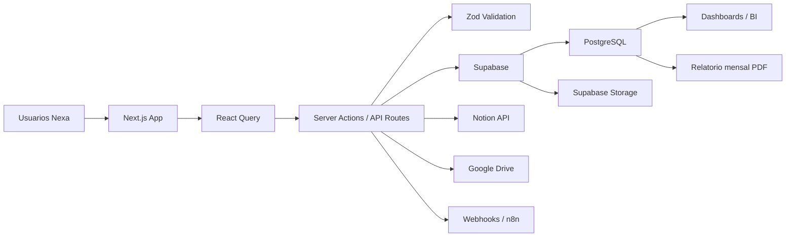
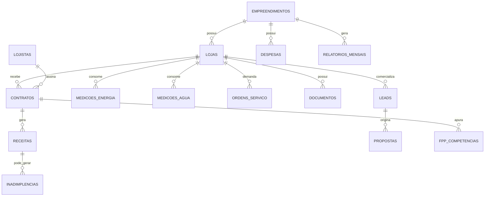

# Nexa OS - Entrega inicial para aprovacao

## 1. Visao do produto

O Nexa OS sera a plataforma proprietaria da Nexa Malls para gestao integrada de ativos comerciais. A primeira implantacao operacional sera o Villa Viseu, em Uberlandia/MG, mas a arquitetura nasce multiempreendimento para receber Piazza Nicomedes, Bluemall Rondon, Bluemall Centro, Boulevard Naves e novos ativos futuros.

O sistema deve unificar dados comerciais, financeiros, juridicos, operacionais, documentais e de BI em uma unica base relacional, com espelhamento operacional para Notion quando fizer sentido para gestao, acompanhamento e colaboracao.

## 2. Principios de arquitetura

- Multiempreendimento desde o primeiro dia.
- PostgreSQL como fonte oficial dos dados.
- Notion como camada colaborativa e operacional, nao como banco mestre.
- Supabase para autenticacao, banco, storage, realtime e Row Level Security.
- Next.js como aplicacao principal.
- API interna tipada com TypeScript, Zod e React Query.
- Componentizacao com ShadCN UI e Tailwind CSS.
- Dashboards com Recharts.
- Integracoes externas desacopladas por jobs, webhooks e tabelas de sincronizacao.
- Controle de acesso por perfil, empreendimento e modulo.
- Auditoria obrigatoria para entidades criticas.

## 3. Arquitetura tecnica proposta



### Camadas

| Camada | Responsabilidade |
| --- | --- |
| Interface | Telas operacionais, dashboards, formularios, kanbans e relatorios |
| Aplicacao | Validacoes, regras de negocio, permissoes e orquestracao |
| Dados | PostgreSQL com tabelas normalizadas, views e funcoes |
| Documentos | Supabase Storage e links externos do Google Drive |
| Notion | Bases sincronizadas para acompanhamento e colaboracao |
| Automacoes | Alertas, vencimentos, inadimplencia, relatorios e webhooks |
| BI | Views agregadas, indicadores e dashboards por empreendimento |

## 4. Modelo de dominio

Entidades nucleares:

- `empreendimentos`
- `lojas`
- `lojistas`
- `contratos`
- `receitas`
- `despesas`
- `inadimplencias`
- `condominio_lancamentos`
- `fundo_promocao_lancamentos`
- `fpp_competencias`
- `auditorias_faturamento`
- `leads`
- `propostas`
- `ordens_servico`
- `documentos`
- `juridico_casos`
- `medicoes_energia`
- `medicoes_agua`
- `relatorios_mensais`
- `indicadores_snapshot`

Relacionamentos principais:



## 5. Estrutura inicial do banco de dados

### Padroes globais

Todas as tabelas operacionais devem ter:

- `id uuid primary key`
- `empreendimento_id uuid` quando o dado pertencer a um ativo
- `created_at timestamptz`
- `updated_at timestamptz`
- `created_by uuid`
- `updated_by uuid`
- `deleted_at timestamptz` para soft delete em entidades de negocio

### Tabelas base

| Tabela | Finalidade |
| --- | --- |
| `profiles` | Extensao do usuario autenticado, perfil e status |
| `role_permissions` | Permissoes por perfil e modulo |
| `user_enterprises` | Quais empreendimentos cada usuario pode acessar |
| `empreendimentos` | Cadastro dos ativos comerciais |
| `lojas` | Cadastro fisico/comercial das lojas |
| `lojistas` | Cadastro dos operadores e empresas |
| `contratos` | Contratos de locacao e anexos principais |
| `contract_alerts` | Alertas de 24, 12, 6 e 3 meses antes do vencimento |

### Tabelas financeiras

| Tabela | Finalidade |
| --- | --- |
| `receitas` | Contas a receber por competencia e rubrica |
| `despesas` | Contas a pagar por competencia, fornecedor e centro de custo |
| `pagamentos_recebidos` | Baixas e conciliacoes de receitas |
| `pagamentos_realizados` | Baixas e conciliacoes de despesas |
| `inadimplencias` | Aging, historico, negociacao e responsavel |
| `condominio_lancamentos` | Receitas e despesas condominiais |
| `fundo_promocao_lancamentos` | Arrecadacao e uso do fundo |
| `fpp_competencias` | Apuracao do aluguel percentual |
| `auditorias_faturamento` | Comparacao ERP, PDV, adquirentes, PIX, iFood e delivery |

### Tabelas operacionais

| Tabela | Finalidade |
| --- | --- |
| `ordens_servico` | Kanban de manutencao e operacao |
| `medicoes_energia` | Consumo CEMIG por loja e competencia |
| `medicoes_agua` | Consumo DMAE por loja e competencia |
| `documentos` | Gestao documental com links e validade |
| `juridico_casos` | Notificacoes, acoes, garantias, renovacoes e pendencias |
| `marketing_acoes` | Campanhas, despesas e resultados do fundo |

### Tabelas comerciais e BI

| Tabela | Finalidade |
| --- | --- |
| `leads` | Pipeline de comercializacao |
| `propostas` | Propostas enviadas e historico |
| `ocupacao_snapshots` | Fotos mensais de ocupacao e vacancia |
| `indicadores_snapshot` | KPIs calculados por competencia |
| `relatorios_mensais` | Historico de PDFs e recomendacoes |
| `audit_logs` | Trilha de alteracoes |
| `notion_sync_log` | Controle de sincronizacao com Notion |

## 6. Regras de negocio centrais

### Ocupacao e vacancia

- ABL ocupada = soma da area total das lojas com status `ocupada`.
- ABL disponivel = soma da area total das lojas com status `disponivel`, `negociacao`, `implantacao` ou `em_obra`, conforme regra de cada dashboard.
- Taxa de ocupacao = ABL ocupada / ABL total.
- Vacancia fisica = ABL vaga / ABL total.
- Vacancia financeira = receita potencial vaga / receita potencial total.

### FPP

Regra por competencia:

- `valor_percentual = faturamento_auditado * percentual`.
- Se `valor_percentual > aluguel_minimo`, cobrar `valor_percentual`.
- Se `valor_percentual <= aluguel_minimo`, cobrar `aluguel_minimo`.
- `valor_complementar = max(valor_percentual - aluguel_minimo, 0)`.

### Inadimplencia

Regua automatica:

- 5 dias: alerta financeiro.
- 15 dias: contato formal.
- 30 dias: negociacao ativa.
- 60 dias: encaminhar juridico.
- 90 dias: plano critico e diretoria.

### Contratos

Alertas obrigatorios antes do vencimento:

- 24 meses.
- 12 meses.
- 6 meses.
- 3 meses.

### Auditoria de faturamento

Alertas:

- Divergencia acima de 5%.
- Divergencia acima de 10%.
- Queda acima de 20%.

## 7. Databases do Notion

O Notion deve espelhar os dados mais uteis para acompanhamento, cobranca e reunioes. A base oficial permanece no PostgreSQL.

### Bases a criar

1. Empreendimentos
2. Lojas
3. Lojistas
4. Contratos
5. Receitas
6. Despesas
7. Inadimplencia
8. Condominio
9. Fundo Promocao
10. FPP
11. Auditoria Faturamento
12. Leads
13. Propostas
14. Vacancia
15. Ocupacao
16. Energia
17. Agua
18. OS
19. Juridico
20. Documentos
21. Marketing
22. Relatorios
23. Indicadores

### Relacoes principais no Notion

| Base | Relacoes |
| --- | --- |
| Empreendimentos | Lojas, Receitas, Despesas, OS, Relatorios, Indicadores |
| Lojas | Empreendimento, Lojista, Contratos, Receitas, Documentos, OS, Energia, Agua, FPP |
| Lojistas | Lojas, Contratos, Inadimplencia, Juridico |
| Contratos | Loja, Lojista, Receitas, FPP, Documentos, Juridico |
| Receitas | Empreendimento, Loja, Contrato, Inadimplencia |
| Despesas | Empreendimento, Condominio, Fundo Promocao, Marketing |
| Leads | Empreendimento, Loja, Propostas |
| OS | Empreendimento, Loja, Documentos |
| Relatorios | Empreendimento, Indicadores |

### Politica de sincronizacao

- Criacao e edicao principal no Nexa OS.
- Sincronizacao unidirecional inicial: Nexa OS -> Notion.
- Sincronizacao bidirecional somente em campos seguros: status, responsavel, proxima acao, observacoes.
- Tabela `notion_sync_log` deve guardar `entity_type`, `entity_id`, `notion_page_id`, `last_synced_at`, `status` e `error`.

## 8. Navegacao proposta

Sidebar principal:

1. Dashboard Executivo
2. Empreendimentos
3. Lojas
4. Lojistas
5. Contratos
6. Financeiro
7. Inadimplencia
8. Condominio
9. Fundo de Promocao
10. FPP
11. Auditoria de Faturamento
12. Comercializacao
13. Ocupacao e Vacancia
14. Energia
15. Agua
16. Ordens de Servico
17. Documentos
18. Juridico
19. BI
20. Relatorios
21. Configuracoes

Filtros globais:

- Empreendimento.
- Competencia.
- Status.
- Responsavel.
- Segmento.

## 9. Wireframes textuais

### Dashboard Executivo

```text
+--------------------------------------------------------------------------------+
| Nexa OS       [Empreendimento: Todos v] [Competencia: Maio/2026 v] [Usuario]   |
+----------------------+---------------------------------------------------------+
| Menu lateral         | KPIs gerais                                             |
| - Dashboard          | [Empreend.] [Lojas] [ABL] [Ocupacao] [Vacancia]        |
| - Lojas              |                                                         |
| - Financeiro         | Receita                                                |
| - Operacoes          | [Aluguel] [Condominio] [FPP] [Total Imobiliario]       |
| - BI                 |                                                         |
|                      | Financeiro                                             |
|                      | [A receber] [Vencidas] [Inadimplencia] [Saldo]         |
|                      |                                                         |
|                      | Graficos                                               |
|                      | [Receita por empreendimento] [Ocupacao x Vacancia]     |
|                      |                                                         |
|                      | Alertas                                                |
|                      | [Contratos vencendo] [OS abertas] [Divergencias]       |
+----------------------+---------------------------------------------------------+
```

### Lojas

```text
+--------------------------------------------------------------------------------+
| Lojas  [Empreendimento v] [Status v] [Segmento v] [Buscar...] [+ Nova loja]    |
+--------------------------------------------------------------------------------+
| Cards KPI: Total | Ocupadas | Disponiveis | Negociacao | ABL vaga              |
+--------------------------------------------------------------------------------+
| Tabela                                                                         |
| Codigo | Loja | Empreendimento | Area | Segmento | Status | Aluguel | Acoes    |
+--------------------------------------------------------------------------------+
| Painel lateral ao selecionar: dados, contrato ativo, documentos, OS, historico  |
+--------------------------------------------------------------------------------+
```

### Inadimplencia Kanban

```text
+--------------------------------------------------------------------------------+
| Inadimplencia [Empreendimento v] [Responsavel v] [Competencia v]               |
+--------------------------------------------------------------------------------+
| 5 dias         | 15 dias        | 30 dias        | 60 dias        | 90 dias     |
| Card loja      | Card loja      | Card loja      | Card loja      | Card loja   |
| Valor          | Valor          | Valor          | Valor          | Valor       |
| Acao           | Acao           | Acao           | Acao           | Acao        |
+--------------------------------------------------------------------------------+
```

### Ordens de Servico Kanban

```text
+--------------------------------------------------------------------------------+
| OS [Empreendimento v] [Categoria v] [Prioridade v] [+ Nova OS]                 |
+--------------------------------------------------------------------------------+
| Aberta | Em triagem | Em execucao | Aguardando terceiro | Concluida             |
| Cards com categoria, loja, prazo, responsavel, custo previsto e prioridade      |
+--------------------------------------------------------------------------------+
```

## 10. Modelo visual

Direcao visual:

- Interface executiva, densa e objetiva.
- Fundo claro neutro.
- Sidebar discreta.
- Cards pequenos para KPIs, sem excesso de decoracao.
- Tabelas com filtros fortes, ordenacao e acoes rapidas.
- Kanbans compactos para inadimplencia, comercializacao e OS.
- Uso de cor por significado, nao por enfeite.

Paleta sugerida:

| Uso | Cor |
| --- | --- |
| Texto principal | `#111827` |
| Texto secundario | `#6B7280` |
| Fundo app | `#F7F8FA` |
| Superficie | `#FFFFFF` |
| Borda | `#E5E7EB` |
| Primaria Nexa | `#0F766E` |
| Sucesso | `#16A34A` |
| Alerta | `#D97706` |
| Critico | `#DC2626` |
| Informacao | `#2563EB` |

Componentes:

- `Button`, `Input`, `Select`, `Tabs`, `Dialog`, `Sheet`, `Table`, `DropdownMenu`, `Badge`, `Card`, `Calendar`, `Form`.
- Icones lucide para acoes: filtro, adicionar, editar, baixar, anexar, alerta, grafico, busca.
- Graficos Recharts: linha, barras, pizza pequena, area e composicoes.

## 11. Controle de acesso

Perfis iniciais:

| Perfil | Acesso |
| --- | --- |
| Diretoria | Todos os modulos e todos os empreendimentos autorizados |
| Administrativo | Empreendimentos, lojas, documentos, relatorios e apoio operacional |
| Financeiro | Financeiro, inadimplencia, condominio, fundo, FPP e BI financeiro |
| Comercial | Lojas, lojistas, comercializacao, propostas, ocupacao e vacancia |
| Operacoes | OS, energia, agua, documentos tecnicos e fornecedores |
| Marketing | Fundo promocao, marketing, eventos, documentos e relatorios de marketing |
| Juridico | Contratos, notificacoes, renovacoes, garantias, juridico e documentos |

Permissoes devem ser avaliadas por:

- Perfil.
- Modulo.
- Acao: ler, criar, editar, excluir, exportar, aprovar.
- Empreendimento.

## 12. Roadmap de desenvolvimento

### Fase 0 - Aprovacao funcional e tecnica

- Aprovar esta arquitetura.
- Aprovar modelo de dados.
- Aprovar navegacao e visual.
- Definir campos obrigatorios do Villa Viseu.
- Definir quais bases do Notion serao criadas no primeiro ciclo.

### Fase 1 - Fundacao SaaS

- Criar projeto Next.js.
- Configurar TypeScript, Tailwind, ShadCN UI, React Query, React Hook Form e Zod.
- Configurar Supabase.
- Criar schema inicial.
- Implementar autenticacao, perfis e filtro global por empreendimento.
- Criar layout principal.

### Fase 2 - Cadastros essenciais

- Empreendimentos.
- Lojas.
- Lojistas.
- Contratos.
- Documentos.
- Alertas de vencimento.

### Fase 3 - Dashboard executivo e financeiro

- KPIs gerais.
- Receitas.
- Despesas.
- Contas a receber.
- Contas a pagar.
- Inadimplencia.
- Views agregadas por empreendimento e competencia.

### Fase 4 - Operacoes e utilidades

- OS com Kanban.
- Energia.
- Agua.
- Condominio.
- Fundo de Promocao.
- Documentos e Google Drive.

### Fase 5 - Comercializacao e vacancia

- Pipeline comercial.
- Leads.
- Propostas.
- Ocupacao e vacancia.
- Rankings de lojas criticas e estrategicas.

### Fase 6 - FPP e auditoria de faturamento

- Apuracao de aluguel percentual.
- Auditoria ERP, PDV, adquirentes, PIX, delivery e iFood.
- Alertas de divergencia e queda.

### Fase 7 - BI, Notion e relatorio mensal

- Dashboards especificos por area.
- Sincronizacao com Notion.
- Geracao automatica de PDF mensal.
- Recomendacoes executivas.

## 13. MVP recomendado para primeira aprovacao

Para evitar um produto grande demais antes da validacao, o primeiro ciclo deve entregar:

1. Autenticacao e perfis.
2. Multiempreendimento.
3. Empreendimentos.
4. Lojas.
5. Lojistas.
6. Contratos.
7. Receitas e inadimplencia.
8. Documentos.
9. Dashboard executivo.
10. Notion: Empreendimentos, Lojas, Lojistas, Contratos, Receitas, Inadimplencia, Documentos e Indicadores.

Essa versao ja permite implantar o Villa Viseu com base confiavel, indicadores executivos e estrutura preparada para expandir os demais ativos.
